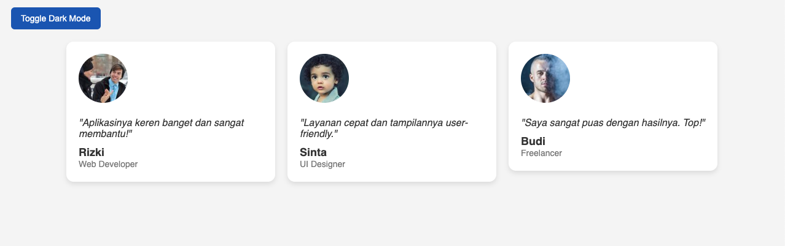
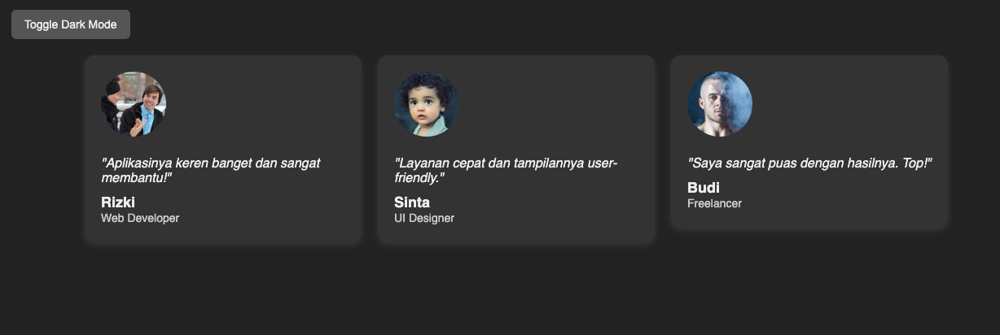

# 💬 Testimonial Cards Project

A simple HTML + CSS project to display user testimonials in a clean and responsive layout.  
Great for learning about layout, Flexbox, media queries, and dark mode — perfect for beginners!

## ✨ What This Project Does

- Displays user testimonials in neat little cards
- Responsive design (looks good on desktop and mobile)
- Built-in dark mode with a toggle button
- Uses Flexbox layout and basic CSS styling

## 🛠 Built With

- HTML5
- CSS3 (including Flexbox and Media Queries)
- Vanilla JavaScript (just a few lines for dark mode)

## 🎯 What I Learned

- How to structure HTML for components (like cards)
- How to use Flexbox to align and space elements
- How to make things responsive with `@media`
- How to toggle dark mode using a simple JavaScript function

## 📸 Screenshot


##


> _You can replace the link above with an actual screenshot of your project_

## 🚀 How to Use

1. Clone this repository or download the ZIP
2. Open `index.html` in your browser
3. Click the "Toggle Dark Mode" button to switch themes
4. Resize your browser to see the responsive layout in action

## 📂 Folder Structure

```

testimonial-cards/
├── index.html
├── style.css
└── README.md

```

## 🌐 Live Demo

You can view it live here:  
[https://rizkilabs.github.io/testimonial-cards/](https://rizkilabs.github.io/testimonial-cards/)  
_(Replace with your actual GitHub Pages link if you deployed it)_

## 🙌 Credits

Made with 💙 by [rizkilabs](rizkilabs.com)<br>
Feel free to fork or customize it for your own project!

https://roadmap.sh/projects/testimonial-cards
